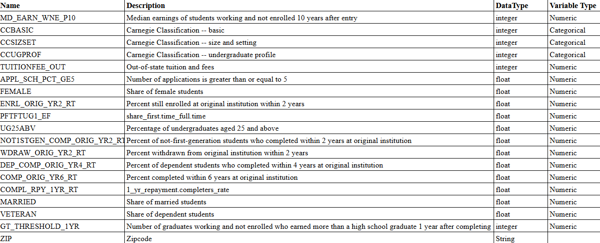
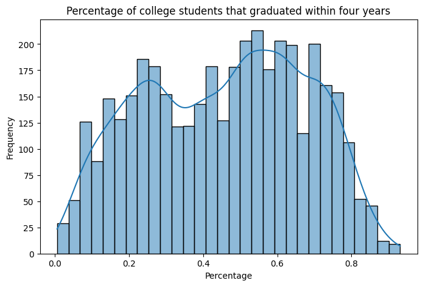
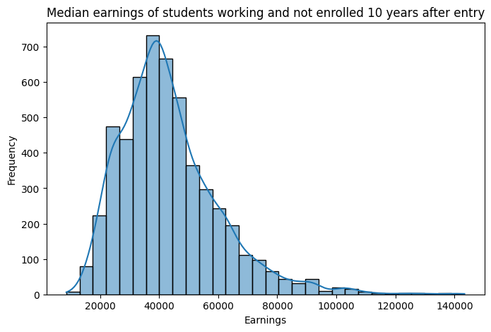
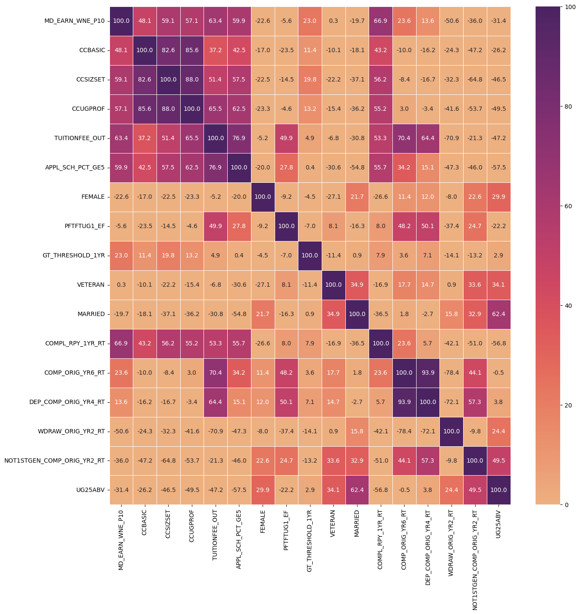
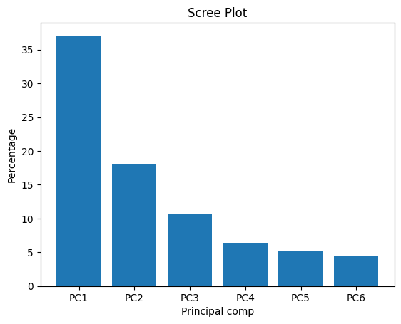
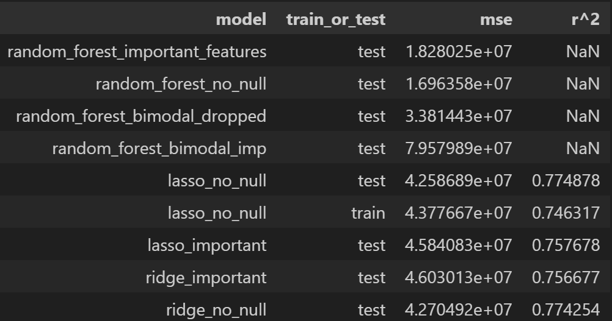
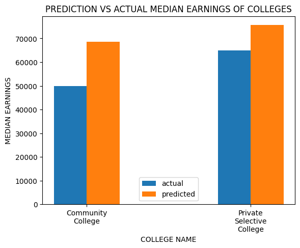

# 2025_ia651_Spagnuolo_Vaccaro
final project for applied machine learning 

# Describe the dataset(s) used.
- The dataset comes from the U.S. Department of Education’s College Scorecard. It contains institutional-level data across a wide range of variables related to college characteristics, student demographics, financial aid, and post-graduate outcomes.

- How to obtain: 
- go to https://collegescorecard.ed.gov/data/
- Download all data files, then go to most recent cohorts
- NOTE: The following glossary contains info about variables 
- https://collegescorecard.ed.gov/data/glossary/ 

# Fields Overview:
## Describe the fields, possibly where the dataset originates, how it was collected, why it might be useful especially if it is not obvious.

The dataset includes:

- Institutional characteristics (e.g., size, type)

- Cost data (e.g., tuition, financial aid)

- Student demographics (e.g., gender, veteran status)

- Academic outcomes (e.g., graduation rates, withdrawal rates)

- Earnings data (e.g., median earnings 10 years after graduation)

- This dataset is useful for identifying patterns in post-graduate success and understanding what institutional factors influence student outcomes. It’s particularly relevant for prospective students and policymakers.

# Outline what you plan to predict.  
## How might this prediction be used in production or in practice?

We plan to try and predict the median earnings of students not enrolled at the institution 10 years after graduation.

Use case: This prediction could be used to help:

- Students/parents compare institutions by expected ROI.

- Policy analysts identify institutional gaps or strengths.

- Colleges to benchmark or improve their own outcomes.

# Process overview
## Narrative which outlines your experience for the project.  This is where you can discuss any iterative approaches, mis-steps or pivoting you made during the course of the project.

This project involved iterative experimentation with different modeling strategies and preprocessing techniques. 

Key pivots included:

- Testing different imputation strategies (median vs dropping nulls) for bimodal data.

- Exploring multicollinearity with VIF and looking to remove problematic features.

- Using PCA to reduce dimensionality and address multicollinearity.

- Trying multiple models and finding the best hyperparameters using grid search and cross-validation.

- Comparing model performance to select the best one for interpretability and predictive power.

## EDA 

### What are your X and Y variables?

X - CCBASIC, CCSIZSET, CCUGPROF, TUITIONFEE_OUT, APPL_SCH_PCT_GE5, FEMALE, ENRL_ORIG_YR2_RT, PFTFTUG1_EF, UG25ABV NOT1STGEN_COMP_ORIG_YR2_RT, WDRAW_ORIG_YR2_RT, DEP_COMP_ORIG_YR4_RT, COMP_ORIG_YR6_RT, COMPL_RPY_1YR_RT, MARRIED, VETERAN, GT_THRESHOLD_1YR

Y - MD_EARN_WINE_P10(median earnings of students not enrolled 10 years after graduation)

Classification or regression?  
- Regression

### How many observations?
features to obs.
~ 17 usable features after cleaning and handling values

# Feature Distributions:
## What is the distribution of each feature?  You don't need to show every feature's distribution.  Focus on features which are imbalanced or may present a problem when training a model.
Skewed: some outcome rates and demographic proportions

Bimodal: COMP_ORIG_YR6_RT, DEP_COMP_ORIG_YR4_RT

We explored two paths:

- Imputing missing values (median)

- Dropping rows with nulls (for model stability)

## Target Variable Distribution:

Distribution was moderately right-skewed.

## Correlation - are some features strongly correlated?  
Some strong correlations between completion/withdrawal-related metrics, raising concerns about multicollinearity 

# Feature importance.
## Are you using all features for X.  If so, make a case for that. If not, make a case for the feature selection you used.

VIF Analysis showed multicollinearity across several academic outcome variables.

PCA reduced dimensionality, retaining 80% of explained variance 

Random Forest and Stepwise Regression helped evaluate feature importance from different perspectives (model-based vs linear dependence).

We chose not to use all original features — instead:

- Removed features with high VIF

- Used PCA-transformed features for models like Random Forest

- Interpreted feature importance based on both PCA component weights and original variable importances

## Feature engineering Which features needed feature engineering?  Discussion:Label encoding vs. one hot encoding Cross featuresMore advanced encoding / feature engineering you might have completed.

- Categorical Variables were label encoded already (we chose not to use one hot encoding as it would create a large amount of columns)

- Data was scaled for PCA and linear models.

- No advanced encoding or cross-features were used, but imputation strategies were varied.

# Model fitting
## Train / test splitting
How was this performed? How did you decide the train/test sizes?
- 80/20 split using train_test_split()
We chose an 80/20 train-test split to balance two key goals:
- Training the model on a sufficiently large dataset, so it could learn patterns and generalize effectively.
- Holding out enough data for testing, to evaluate how well the model performs on unseen data.
- Standard adn widely accepted split for regression problems with a moderate to large number of observations when the data is not time series or sequential
- No stratification (Y is continuous)

## Does your dataset have a risk of data leakage? Describe those risks. This is usually true for time series datasets

- No major leakage risks (not time-series, and no target leakage observed)

## Which model did you select, why?
- Lasso Regression using only features that showed importance after PCA: R^2: 0.758  MSE:  45840826.33 
- Lasso Regression using all features highest R^2 value (0.775, and low MSE 42586891.87)
- Ridge Regression using only features that showed importance after PCA: R^2 = 0.757 MSE: 46030129.55
- Ridge Regression using all features: R^2: 0.774 MSE: 42704921.96
- Stepwise Regression (using 11 features): R^2: 0.661 MSE: 30368563597.38 (Not shown in table below)

## Many have tried multiple model types - what is the thought process for trying these types?

The four types of models we chose were:
1. Random Forest - flexible, handled nonlinearity well
2. Lasso Regression- best performance, however sensitive to alpha
3. Ridge Regression- similar to lasso, adds a different value to the cost function
4. Stepwise Linear Regression- more interpretable, but we struggled to reduce the multicolinearity

## Only use models learned in class (linear regression, logistic regression, SVC/SVM, decision trees (including random forests, etc)) What was the process for hyper parameter selection if applicable. Any processes for searching for hyperparameters or ensemble approaches (e.g. cross fold validation, Gridsearch) should be outlined here.
1. Random Forest Grid Search CV to search for best hyperparameters
2. LassoCV to search for best hyperparameters
3. RidgeCV to search for best hyperparameters
4. StepWise Regression- scaled the data (NOT PCA Data), added constant, used VIF to help determine what features to get rid of to reduce multicolinearity (Condition number)- Forward stepwise

# Validation / metrics
## Which metrics did you weigh most heavily, why?
 Accuracy, r^2, balanced accuracy, ROC, AUC, Recall, Precision, etc..
 Confusion matrix and confusion discussion for classification problems

- r^2 and MSE, regression problem 
- No classification, so no confusion matrix or ROC/AUC

## Highlight model weaknesses
- Stepwise- too much multicolinearity, cuased condition  number to be very large, assumes linearity

- PCA/Random Forest - Hard to interpret, not ideal for extrapolation, tried imputation with both median (worse) and dropping nulls for bimodal data

- Lasso Regression - overly penalize relevant features, assumes linearity, (had to be careful when selecting the best alpha- defaulted to selecting too high of an alpha wihtout range)

- Ridge Regression - decent, but underperformed Lasso

## Give 2-4 prediction examples from your data.

## Give 2 prediction examples which are new or synthesized. 

# Overfitting/Underfitting
## Identify if model is overfitting or underfitting
    -Model we chose: Lasso (using all features as predictors) - better generalization- Training r^2 (0.746) was very comparable to our testing r^2(0.775)
    -Stepwise -  generally underfit
    -Random Forest- generally overfit

## Identify and apply techniques to mitigate underfitting/overfitting
Techniques Used:

- Regularization (Lasso/Ridge)

- Cross-validation

- PCA (for complexity reduction)

- Feature selection based on VIF

# Production
## Give any advice for deployment of use of this model
Advice for Deployment:

- Retrain periodically as new college data is released

- Include explanations/warnings about uncertainty

## Outline precautions about its use here
- Does not account for individual student differences (e.g., major, internship experience)

- Institutional-level data only — not a personalized prediction model

- External economic factors not captured

# Going further
## What could make this model better?
More data, additional features, more augmentation etc.
- Use student-level data 

- Include major/program, region, or employment status

- Try other nonlinear models 

- Address imbalanced data or missing at random values with more sophisticated imputation

- Finding out why there were so many NaNs for some of the fields. 

- We believe this model worked better for colleges with higher median earnings 10 yrs after graduation. Could create separate models for colleges with lower versus higher median earnings
- Create different models for diffferent types (2yr, 4yr, etc) of colleges

